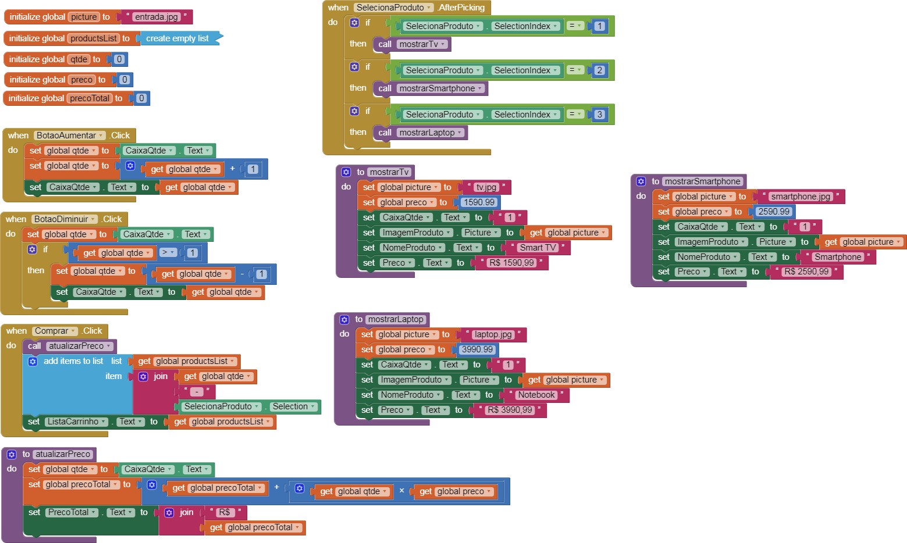

# Lab03 - Model-View-Controller

## Tarefa 1

## Tarefa 2

1. Cada componente Fornecedor provê uma lista com seus produtos em estoque para o componente Seleciona Produto;
2. No componente Seleciona Produto, o cliente escolhe um produto do catálogo de produtos dos fornecedores;
3. O componente Leilão recebe as informações do produto desejado através da interface IProduto;
4. O componente Leilão publica uma mensagem no barramento com o tópico "leilão" contendo o produto desejado;
5. Os componentes do tipo Fornecedor assinam o tópico "leilão", recebem o produto e publicam uma mensagem com o tópico "oferta" contendo o valor deste produto;
6. O componente Leilão assina o tópico "oferta" e seleciona as três melhores ofertas, que são providas através da interface IMelhorOferta.

## Tarefa 3

Tela 1 - nenhum produto selecionado:

Tela 2 - primeiro produto selecionado:

Tela 3 - segundo produto selecionado:

Tela 4 - compra de um dos produtos efetiva:

Tela 5 - diagrama de blocos do aplicativo:

Arquivo do projeto
[Arquivo MIT App](app/market_place.aia)