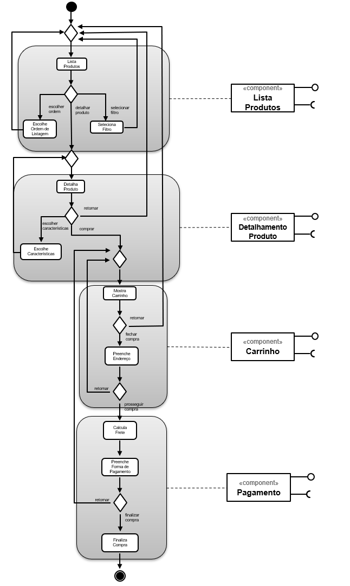
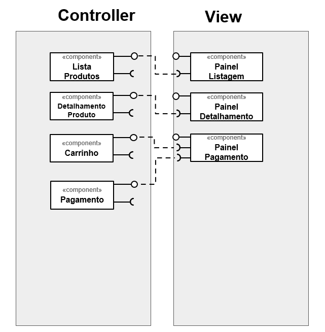
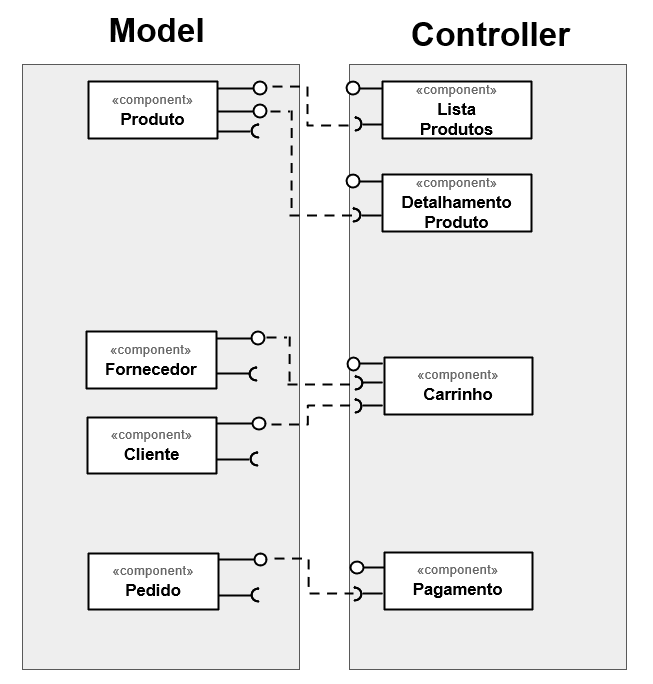

# Lab04 - Serviços

## Tarefa 1

## Tarefa 2

## Tarefa 3

## Tarefa 4

### Serviço 1

* **Título do serviço**: `<BikeWise API v2>`
* **Breve descrição**:
    Serviço que recebe como parâmetros uma localização (como o CEP por exemplo) e um intervalo de tempo no formato UNIX Timestamp, e retorna informações sobre incidentes relacionados ao ciclicismo.
* **URL completa da requisição**: `<https://bikewise.org/api/v2/incidents?page=1&per_page=2&occurred_before=1598486400&occurred_after=1577836800&incident_type=theft&proximity=78229&proximity_square=10>`
* **Cabeçalho HTTP da chamada**:
~~~http
GET /https://bikewise.org/api/v2/incidents?page=1&per_page=2&occurred_before=1598486400&occurred_after=1577836800&incident_type=theft&proximity=78229&proximity_square=10 HTTP/2
Host: any-api.com:8443
User-Agent: Mozilla/5.0 (Windows NT 6.1; Win64; x64; rv:78.0) Gecko/20100101 Firefox/78.0
Accept: */*
Accept-Language: pt-BR,pt;q=0.8,en-US;q=0.5,en;q=0.3
Accept-Encoding: gzip, deflate, br
Origin: https://any-api.com
Connection: keep-alive
Referer: https://any-api.com/bikewise_org/bikewise_org/console/incidents/GET_version_incidents_format_
If-None-Match: W/"a45c2ff8ee42f7c4cd4a0fd35655dfc8"
TE: Trailers
~~~
* **Cabeçalho HTTP da resposta**:
~~~http
HTTP/2 200 OK
date: Thu, 27 Aug 2020 18:14:38 GMT
content-type: application/json
set-cookie: __cfduid=daf0ed07768fe1a7468b76ae367c4397d1598552078; expires=Sat, 26-Sep-20 18:14:38 GMT; path=/; domain=.any-api.com; HttpOnly; SameSite=Lax
x-request-url: https://bikewise.org/api/v2/incidents?page=1&per_page=2&occurred_before=1598486400&occurred_after=1577836800&incident_type=theft&proximity=78229&proximity_square=10
status: 200 OK
access-control-allow-origin: *
access-control-request-method: *
link: <https://bikewise.org:8443/api/v2/incidents?incident_type=theft&occurred_after=1577836800&occurred_before=1598486400&page=9&per_page=2&proximity=78229&proximity_square=10>; rel="last", <https://bikewise.org:8443/api/v2/incidents?incident_type=theft&occurred_after=1577836800&occurred_before=1598486400&page=2&per_page=2&proximity=78229&proximity_square=10>; rel="next"
total: 17
per-page: 2
etag: W/"a45c2ff8ee42f7c4cd4a0fd35655dfc8"
cache-control: max-age=0, private, must-revalidate
x-request-id: 6487cf82-ab5c-4e09-bc60-2149e90da5ce
x-runtime: 0.034690
access-control-allow-methods: GET, POST, OPTIONS
access-control-expose-headers: date,content-type,transfer-encoding,connection,status,access-control-allow-origin,access-control-request-method,link,total,per-page,etag,cache-control,x-request-id,x-runtime,access-control-allow-methods,access-control-expose-headers,access-control-max-age,access-control-allow-credentials,vary,x-powered-by,cf-cache-status,cf-request-id,expect-ct,server,cf-ray,content-encoding,x-final-url
access-control-max-age: 1728000
access-control-allow-credentials: true
vary: Origin
x-powered-by: cloud66
cf-cache-status: DYNAMIC
cf-request-id: 04d2ba10d10000cfe4ae148200000001
expect-ct: max-age=604800, report-uri="https://report-uri.cloudflare.com/cdn-cgi/beacon/expect-ct"
x-final-url: https://bikewise.org/api/v2/incidents?page=1&per_page=2&occurred_before=1598486400&occurred_after=1577836800&incident_type=theft&proximity=78229&proximity_square=10
server: cloudflare
cf-ray: 5c97c5faec46cfe4-GRU
content-encoding: br
X-Firefox-Spdy: h2
~~~
* **Conteúdo da resposta**:
~~~json
{
  "incidents": [
    {
      "id": 124983,
      "title": "Stolen 2020 Specialized Rockhopper Comp 1X(black)",
      "description": "",
      "address": "San Antonio, TX, 78238",
      "occurred_at": 1598104800,
      "updated_at": 1598551251,
      "url": "https://bikewise.org/api/v1/incidents/124983",
      "source": {
        "name": "BikeIndex.org",
        "html_url": "https://bikeindex.org/bikes/843301",
        "api_url": "https://bikeindex.org/api/v1/bikes/843301"
      },
      "media": {
        "image_url": "https://files.bikeindex.org/uploads/Pu/314291/large_D750568C-7CB1-4D0F-9998-62A71387AB3F.png",
        "image_url_thumb": "https://files.bikeindex.org/uploads/Pu/314291/small_D750568C-7CB1-4D0F-9998-62A71387AB3F.png"
      },
      "location_type": null,
      "location_description": null,
      "type": "Theft",
      "type_properties": null
    },
    {
      "id": 123592,
      "title": "Stolen 2020 Fuji Nevada 29 1.7(green and black)",
      "description": "Level 4 garage lock was cut ",
      "address": "San Antonio, TX, 78215",
      "occurred_at": 1596513600,
      "updated_at": 1598551337,
      "url": "https://bikewise.org/api/v1/incidents/123592",
      "source": {
        "name": "BikeIndex.org",
        "html_url": "https://bikeindex.org/bikes/832718",
        "api_url": "https://bikeindex.org/api/v1/bikes/832718"
      },
      "media": {
        "image_url": null,
        "image_url_thumb": null
      },
      "location_type": null,
      "location_description": null,
      "type": "Theft",
      "type_properties": null
    }
  ]
}
~~~

### Serviço 2

* **Título do serviço**: `<ODWeather>`
* **Breve descrição**:
  Serviço que recebe como parâmetros uma estação climática e um período, e retorna informações meteorológicas do local.
* **URL completa da requisição**: `<http://api.oceandrivers.com/v1.0/getWeatherDisplay/cnarenal/?period=latestdata>`
* **Cabeçalho HTTP da chamada**:
~~~http
GET /http://api.oceandrivers.com/v1.0/getWeatherDisplay/cnarenal/?period=latestdata HTTP/2
Host: any-api.com:8443
User-Agent: Mozilla/5.0 (Windows NT 6.1; Win64; x64; rv:79.0) Gecko/20100101 Firefox/79.0
Accept: application/json
Accept-Language: pt-BR,pt;q=0.8,en-US;q=0.5,en;q=0.3
Accept-Encoding: gzip, deflate, br
Origin: https://any-api.com
Connection: keep-alive
Referer: https://any-api.com/oceandrivers_com/oceandrivers_com/console/ODWeather/getWeatherDisplay
~~~
* **Cabeçalho HTTP da resposta**:
~~~http
HTTP/2 200 OK
date: Thu, 27 Aug 2020 19:14:57 GMT
content-type: application/json
set-cookie: __cfduid=dc76afcbccf1afc91c15ee2c3a5e228d31598555696; expires=Sat, 26-Sep-20 19:14:56 GMT; path=/; domain=.any-api.com; HttpOnly; SameSite=Lax
x-request-url: http://api.oceandrivers.com/v1.0/getWeatherDisplay/cnarenal/?period=latestdata
x-cors-redirect-1: 301 https://api.oceandrivers.com/v1.0/getWeatherDisplay/cnarenal/?period=latestdata
access-control-allow-origin: *
access-control-allow-methods: POST, GET, OPTIONS, DELETE, PUT
access-control-max-age: 1000
access-control-allow-headers: x-requested-with, Content-Type, origin, authorization, accept, client-security-token
x-final-url: https://api.oceandrivers.com/v1.0/getWeatherDisplay/cnarenal/?period=latestdata
access-control-expose-headers: date,server,content-length,access-control-allow-origin,access-control-allow-methods,access-control-max-age,access-control-allow-headers,connection,content-type,x-final-url
cf-cache-status: DYNAMIC
cf-request-id: 04d2f146220000f1f29497c200000001
expect-ct: max-age=604800, report-uri="https://report-uri.cloudflare.com/cdn-cgi/beacon/expect-ct"
server: cloudflare
cf-ray: 5c981e50389cf1f2-GRU
content-encoding: br
X-Firefox-Spdy: h2
~~~
* **Conteúdo da resposta**:
~~~json
{
  "TWS_GUST_MAX": {
    "TIME_STRING": "27-8-2020 1:07_PM:00",
    "VALUE": "17.4"
  },
  "TWD": 181,
  "HUMIDEX": 38.5,
  "TWS": 0.3,
  "LOCALTIME": 2,
  "HUMIDITY_IN": 100,
  "WINDCHILL": 27.2,
  "TEMP_IN": 51,
  "ICON_NOW": "1",
  "ICON_FOR": "1",
  "TEMPERATURE": 27.2,
  "TWS_GUST": 0,
  "RAIN": 0,
  "PRESSURE": 1013.4,
  "LONGITUDE": 2.733,
  "ACTIVE": "ON",
  "PRESSURE_TR": 0,
  "RAIN_MONTH": 0.4,
  "RAIN_DAY": 0,
  "HUMIDITY": 83,
  "TIME_STRING": "27-8-2020 21:14:53",
  "TIME": 1598555693000,
  "LATITUDE": 39.5,
  "WEATHER_DES": "Dry/Dusk"
}
~~~