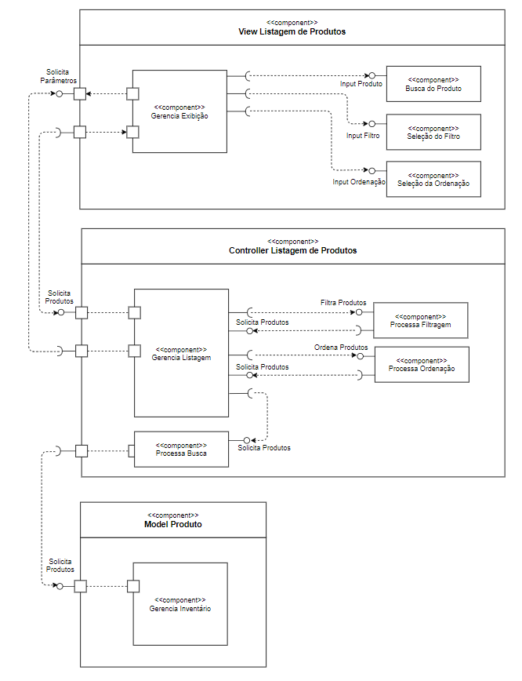

# Lab05 - Subcomponentes e Páginas Dinâmicas

## Tarefa 1

## Tarefa 2
Link para o projeto no Codepen: [React 03 - Componente Barra](https://codepen.io/dennips/pen/xxVPBad)

**HTML**
~~~html

~~~

**JavaScript**
~~~javascript
class NomeDino extends React.Component {

	constructor(props){
		super(props);
		this.state = { nome: ''};
	}

	handleChange = ({ target }) => {
		this.setState({ [target.name]: target.value });
	};

	render() {
		return (
			<React.Fragment>
				<form>
					<label htmlFor="nome">Digite o nome do dinossauro: </label>
					<input
						type="text"
						name="nome"
						value={this.state.nome}
						onChange={this.handleChange}
					/>
				</form>
				<h2>O dinossauro {this.state.nome} pulou na lama.</h2>
			</React.Fragment>
		);
	}
}

ReactDOM.render(
        <NomeDino />, 
        document.getElementById("root"));
~~~